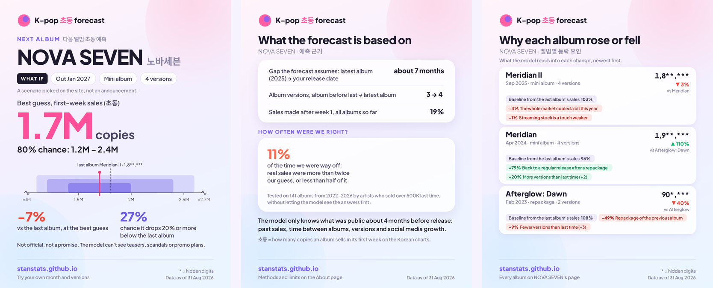

# stanstats · K-pop first-week album sales, forecast before the comeback

**Live site: https://stanstats.github.io/**

*What "Share as images" on the forecast card gives you (the artist and every number here are fictional).*

A non-profit, ad-free data project by a K-pop fan. It answers one question: *if an artist's company were deciding today
whether to make the next album, how many copies would it sell in its first week (초동), and how sure can anyone be?*
Every prediction uses only what is knowable about 120 days before release — the previous album, the artist's history
and public activity — so it is meant to help decide whether the next album should happen, not to explain sales after
the fact. For entertainment only.

## What is on the site

- **Forecast** — pick any of 500 artists, an album type and a version count; get a best guess for the first week,
  three likely ranges (50%, 80% and 90% chance) and the chance that it sells 20% or more below the last album.
  "Share as images" turns it into Instagram-size cards (made in your browser; nothing is uploaded).
- **Artist timelines** — every past album with its change from the album before and what the model reads into that
  change.
- **Findings** — short, sourced write-ups of what the data actually shows (list below).
- **About** — method, error rates by artist size, data sources and licenses, and a contact form.

## Findings

- [What adding an album version does to first-week sales](https://stanstats.github.io/findings/#card-02-what-adding-an-album-version-does-to-fir) — **+10%**
  Sales do not rise in proportion to versions — going from 3 to 4 versions goes with about 10% more first-week sales, and doubling the versions with about 25% more, not 100%.
- [The last album already tells you most of the next one](https://stanstats.github.io/findings/#card-04-the-last-album-already-tells-you-most-of) — **79%**
  Know one number — last comeback's first week — and you know most of what can be known: it accounts for about 79% of the differences between albums.
- [The whole market swings year to year](https://stanstats.github.io/findings/#card-05-the-whole-market-swings-year-to-year) — **+39% → 0%**
  How much the typical comeback grew over the same artist's previous album swung from +39% in 2020 to 0% in 2024: about +30% a year in 2019–2022, +10% in 2023, flat since 2024.
- [The longer the silence, the smaller the first week](https://stanstats.github.io/findings/#card-07-the-longer-the-silence-the-smaller-the-f) — **−6%**
  The typical comeback arrives about eight and a half months after the previous album. Comebacks one to two years after the last album sold about 6% less than comebacks six to twelve months after; four years or more, about 13% less.
- [K-pop albums became a fan-only market: the first week is now 84% of total sales](https://stanstats.github.io/findings/#card-09-k-pop-albums-became-a-fan-only-market-th) — **26% → 84%**
  In 2015 the first week was about 26% of an album's total sales in Korea. In 2025 it was 84%, and 2026 so far is higher still.
- [The typical fan stays for about three years](https://stanstats.github.io/findings/#card-10-the-typical-fan-stays-for-about-three-ye) — **about 3 years**
  Every comeback wins a new group of fans, and each group's support tapers on the albums that follow. The fan life cycle that best fits the data: about 50% of each group is gone after roughly two years.
- [Full album, mini, single, repackage: how they compare](https://stanstats.github.io/findings/#card-13-full-album-mini-single-repackage-how-the) — **+15% / −23% / −47%**
  Compared with a mini album by the same artist, a full album sells about 15% more, a single album about 23% less, and a repackage about 47% less.
- [A drop in sales is a one-off, not a trend](https://stanstats.github.io/findings/#card-14-a-drop-in-sales-is-a-one-off-not-a-trend) — **23% vs 25%**
  After an album falls by more than 20%, the chance that the next one falls again is 23%, about the same as for any album (25%). The lost ground usually stays lost, but the slide does not continue.
- [Boy groups hold on to their sales best; soloists swing the most](https://stanstats.github.io/findings/#card-17-boy-groups-hold-on-to-their-sales-best-s) — **80% / 75% / 60%**
  After a boy-group album, the next one loses no more than 20% of the first-week sales in 80% of cases; for a girl group that happens in 75% of cases, for a soloist in about 60%.
- [Release weekday does not affect first-week sales; it affects which charts an album lands on](https://stanstats.github.io/findings/#card-19-release-weekday-does-not-affect-first-we) — **No difference**
  Albums released on any weekday sell about the same relative to the artist's last album. The weekday matters for weekly charts that close on a fixed day, not for the seven-day first-week count.
- [Follower count tells you how big an artist is; follower growth tells you where they are going](https://stanstats.github.io/findings/#card-20-follower-count-tells-you-how-big-an-arti) — **+34% vs 0%**
  Without sales history, follower count is the single most useful number. Once you know the last album, the follower count adds nothing new — it is measuring the same thing. How fast the fanbase grew during the gap still adds something: the fastest-growing 25% of artists sold 34% more than their last album, the slowest 25% about the same (0%).
- [Messy data is not why forecasts miss: copying mistakes explain about 1% of the error](https://stanstats.github.io/findings/#card-22-messy-data-is-not-why-forecasts-miss-cop) — **about 1%**
  We checked the first-week figures we forecast against the official counts. Almost all matched exactly, and the few wrong ones explain about 1% of our error. Our misses are real differences in what albums sold.

## How it works, in one paragraph

A linear model with a handful of interpretable terms (previous album, album type, version-count change, fan growth,
time since the last release) sets the centre; one tree-based model refines it; the bands come from the model's own
out-of-sample misses on past albums by artists of similar size. The evaluation is rolling: each test year is predicted
by a model that never saw it. Sales figures are never shown raw — only percentage changes, size groups and partly
hidden numbers such as 45*,***.

## Data and refresh

- Data as of **2026-09-03**; the site is rebuilt monthly and the About page shows the data date.
- Sales come from an internal dataset compiled from public sales summaries and charts; artist facts from Wikipedia and
  Soridata; fan growth from public follower counts. Details and licenses are on the About page.
- This repository holds only the static site (HTML, JS, CSS) and the model's published outputs (JSON). It contains no
  raw sales data. The code behind the forecasts (data collection, features, model and evaluation) is private; the
  About page describes the methods, the data sources and the limits of the model.

## Contact

Corrections, missing artists and other messages go through the form linked on the Home, Artist and About pages. Source
maintainers who want a credit worded differently, or something removed, are welcome to use it too.

*Generated 2026-09-29 by the site build.*
